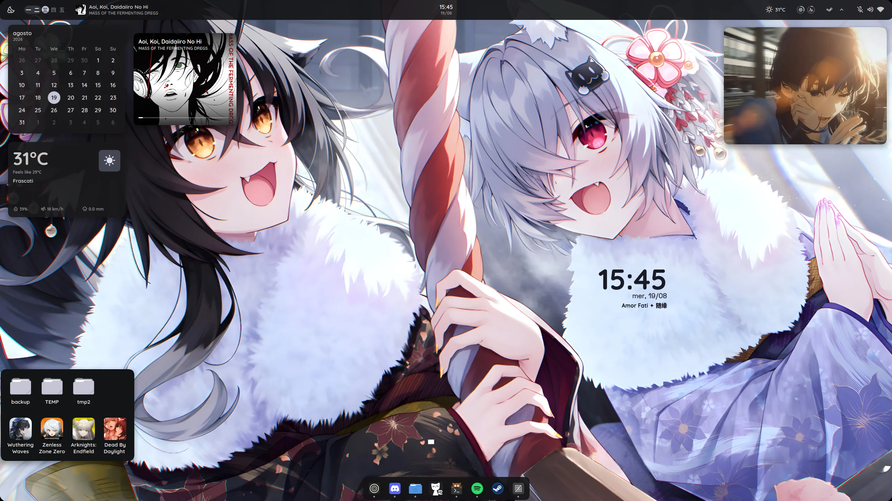
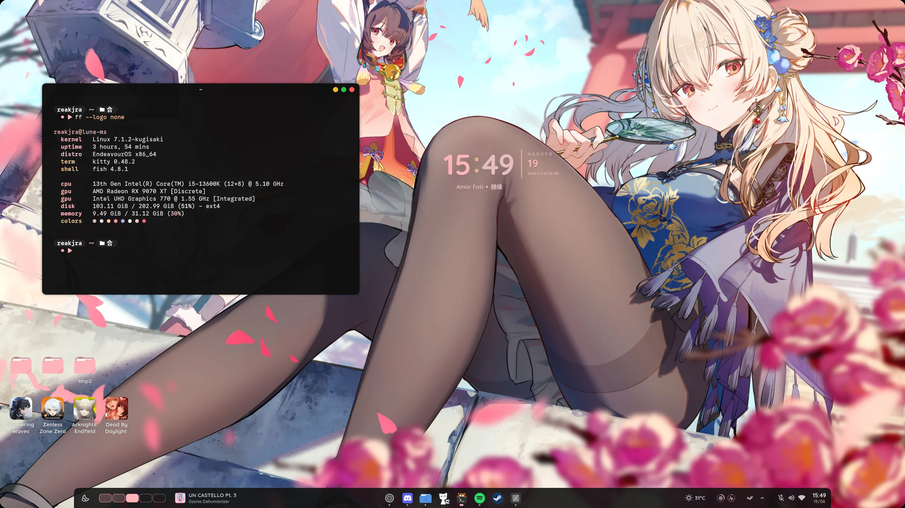
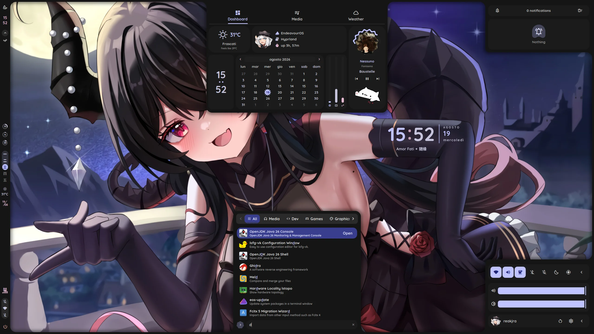
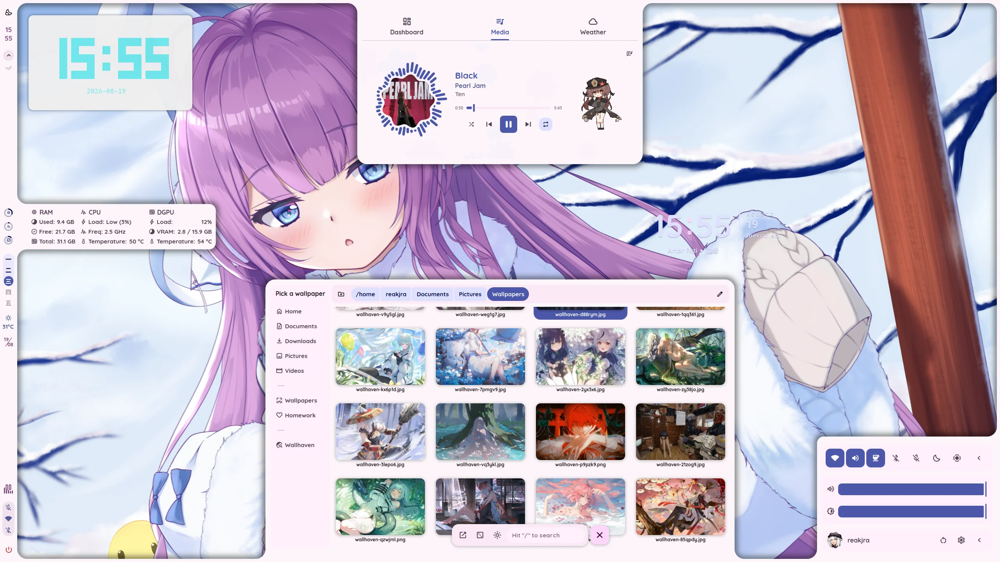
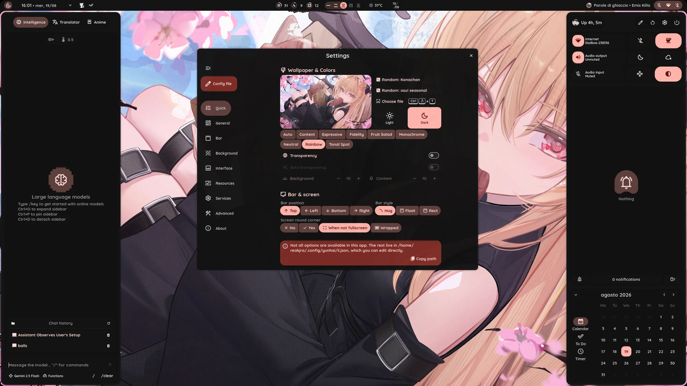
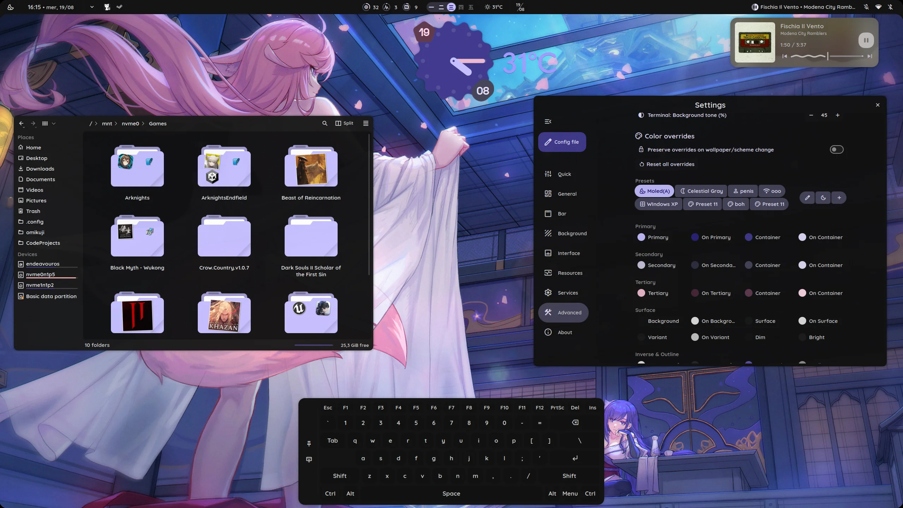

# yunhai

My hyprland dots + quickshell rice.

Based on [end-4's illogical-impulse](https://github.com/end-4/dots-hyprland), mutated well past recognition: four panel families, a bunch of silly SDF shaders effect, even a tiny C clipboard bridge. It got out of hand a bit.

> Note that the rice is mainly for the other two panel families, features wise is not that *much* more than the default illogical-impulse ships. If you want heavily widgetized forks check the credits.

> Also important that the panel families may have mismatched feature parity, fixes and some things may be very months old and untouched since then. You can still find bugs, pitiful code or not really explained things.

Arch only.

> [!WARNING]
> This is not compatible with base illogical-impulse. Config files, panel families and shared widgets have all diverged, it installs it's own stuff, it doesn't apply atop end-4's illogical-impulse.
>
> It does install to its own paths (`~/.config/quickshell/yunhai`, `~/.config/yunhai`, `~/.local/state/quickshell/yunhai`), so it won't overwrite an existing illogical-impulse install (it will override hyprland's tho).

## Screenshots

| | |
|:---|:---|
| Akebono                                    | Akebono                                 |
|     |     |
| Lunae                          | Lunae                                       |
|     |     |
| Illogical Impulse                              | Illogical Impulse                                       |
|  |  |

## Install

```sh
git clone https://github.com/reakjra/yunhai-shell.git
cd yunhai-shell
./install.sh
```

Flags, if you're picky:

| flag | what it does |
|---|---|
| `-y` | assume yes, skips the optional-package prompts |
| `--no-aur` | skip AUR packages (the shell will not run, see below) |
| `--skip-sysupdate` | don't `pacman -Syu` first |
| `--deps-only` `--setups-only` `--files-only` `--build-only` | run a single phase |

### What it does

1. **deps**: `pacman -Syu`, then the base + rice package lists, then AUR, then prompts one by one for the optional extras (`installer/packages/optional.lst`) with a reason for each.
2. **setups**: creates the `i2c` group, adds you to `video`/`i2c`/`input`, enables `ydotool` and `bluetooth`, builds the python venv with `uv`, and sets the GTK font, Darkly widget style and Tela-dark icons.
3. **files**: backs up anything it's about to touch, then copies the configs in.
4. **build**: compiles the shaders with `qsb`, builds the `fileclip` clipboard bridge, and offers to install hyprbars via `hyprpm`.

**AUR is required.** `quickshell-git` is the shell itself, so `--no-aur` gets you a config with nothing to run it. `darkly-bin` (Qt widget style) and `tela-icon-theme` come from there too.

### What it touches

Existing files are copied to `~/.local/state/yunhai/backup-<timestamp>/` before anything is overwritten.

| path | |
|---|---|
| `~/.config/quickshell/yunhai/` | the shell itself |
| `~/.config/hypr/` | hyprland config |
| `~/.config/{matugen,kde-material-you-colors,fuzzel,fontconfig,kitty,fish,wlogout,zshrc.d,xdg-desktop-portal}/` | apps that follow the wallpaper colors |
| `~/.config/{starship.toml,chrome-flags.conf,code-flags.conf,thorium-flags.conf}` | |
| `~/.local/share/{fonts,icons}/` | bundled fonts and icons |

Also: `~/.config/yunhai/` (settings) and `~/.local/state/quickshell/yunhai/` (generated colors, wallpaper, per-family state).

## Panel families

Four shells share one config. Swap with **Ctrl+Super+P**, or `qs -c yunhai ipc call panelFamily cycle`.

\- **Illogical Impulse**: end-4's original, the default.

\- **Waffle**: upstream's windows-ish one.

\- **Lunae**: Caelestia's copycat.

\- **Akebono**: a blown ass desktop: icons, wobbling widgets, a dock, a shelf, windows decorations (hyprbars), desktop widgets etc...


## Credits

- [end-4/dots-hyprland](https://github.com/end-4/dots-hyprland): illogical-impulse, the base this is forked from. Most of what's good here started as theirs.
- [vaguesyntax/ii-vynx](https://github.com/vaguesyntax/ii-vynx): inspiration.
- [pctrade/end4-pC](https://github.com/pctrade/end4-pC): inspiration.
